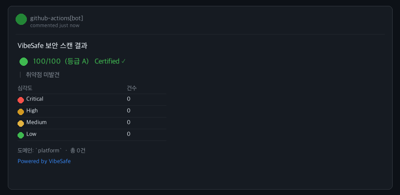
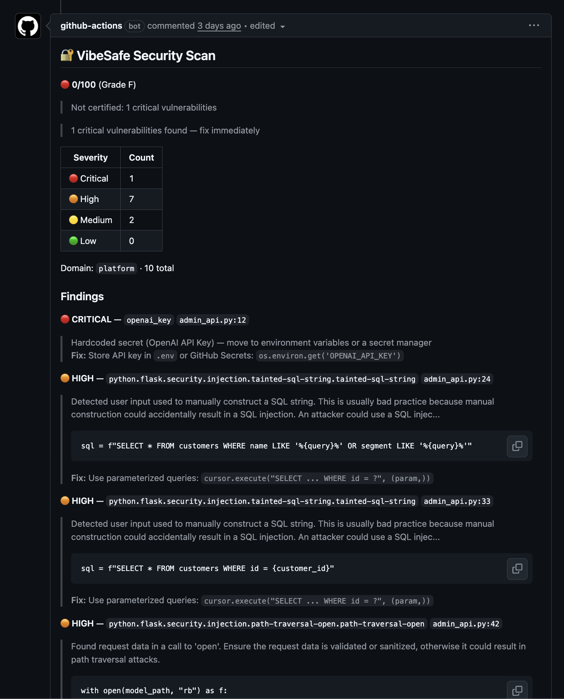

# VibeSafe Security Scan · GitHub Action

> PR마다 자동으로 보안을 검사하고, 결과를 코멘트로 달아줍니다.

바이브 코딩(AI 생성 코드)에서 자주 나타나는 SQL Injection, XSS, 하드코딩된 API 키 등을 PR 단계에서 잡아냅니다.

---

## 실제 PR 코멘트 예시

**취약점 없음 — A등급 Certified**



**취약점 발견 — F등급**



---

## 설치 (30초)

`.github/workflows/vibesafe-scan.yml` 파일 하나 추가하면 끝입니다.

```yaml
name: VibeSafe Security Scan

on:
  pull_request:
    types: [opened, synchronize, reopened]

permissions:
  contents: read
  pull-requests: write

jobs:
  vibesafe:
    name: Security Scan
    runs-on: ubuntu-latest
    timeout-minutes: 10

    steps:
      - uses: actions/checkout@v4

      - name: Run VibeSafe scan
        uses: vibesafeio/vibesafe-action@v0
        with:
          domain: auto
```

PR 코멘트는 action이 자동으로 달아줍니다. 별도 설정 불필요.

---

## Why VibeSafe?

| | VibeSafe | Snyk | CodeQL | Dependabot |
|---|---|---|---|---|
| 설치 시간 | **30초** (YAML 복사) | 30분+ (계정+API키+CLI) | 15분+ (빌드 설정) | 자동 (PR만) |
| 비용 | **무료** | $35K~$90K/년 | 무료 (공개 레포) | 무료 |
| PR 코멘트 | **파일+줄+코드+수정가이드** | 파일+줄 | ❌ | ❌ |
| 바이브 코딩 최적화 | **도메인별 규칙** | ❌ | ❌ | ❌ |
| 시크릿 스캔 | ✅ | ✅ (유료) | ❌ | ❌ |

VibeSafe는 바이브 코더를 위해 만들어졌습니다. 보안팀이 없어도, 24줄이면 충분합니다.

---

## 무엇을 검사하나요

| 항목 | 내용 |
|------|------|
| **SAST** | SQL Injection, XSS, SSRF, IDOR, Command Injection 등 OWASP Top 10 |
| **시크릿 탐지** | API 키, GitHub 토큰, Stripe 키, AWS 자격증명 하드코딩 |
| **도메인별 규칙** | 서비스 유형에 맞는 보안 규칙 자동 선택 |

지원 언어: JavaScript · TypeScript · Python · Java · Go · Ruby · PHP · Kotlin

---

## 도메인 옵션

```yaml
domain: auto        # 코드를 분석해서 자동 분류 (기본값)
domain: ecommerce   # 결제/주문 — PCI DSS 룰 강화
domain: fintech     # 계좌/송금 — 전자금융거래법, AML
domain: healthcare  # 환자정보 — HIPAA, 개인정보보호법
domain: platform    # SaaS/멀티테넌트 — JWT, RBAC
domain: game        # 게임서버 — WebSocket, 클라이언트 조작
domain: education   # 학생정보 — FERPA, COPPA
```

---

## 점수 기준

| 등급 | 점수 | 의미 |
|------|------|------|
| 🟢 **A** + ✅ Certified | 85 ~ 100 | Critical · High 0개 |
| 🟢 **A** | 85 ~ 100 | 양호 |
| 🟡 **B** | 70 ~ 84 | 경미한 취약점 |
| 🟠 **C** | 50 ~ 69 | Medium 취약점 다수 |
| 🔴 **D / F** | 0 ~ 49 | Critical · High 존재 |

**✅ Certified** 배지는 Critical 0 + High 0 + 점수 85 이상일 때 발급됩니다.

---

## Outputs

다른 step에서 결과를 활용할 수 있습니다.

```yaml
- run: echo "Score: ${{ steps.vibesafe.outputs.score }}"
```

| output | 설명 | 예시 |
|--------|------|------|
| `score` | 보안 점수 | `82` |
| `grade` | 등급 | `B` |
| `domain` | 감지된 도메인 | `fintech` |
| `certified` | Certified 여부 | `true` |
| `critical` | Critical 취약점 수 | `0` |
| `high` | High 취약점 수 | `2` |
| `medium` | Medium 취약점 수 | `5` |
| `low` | Low 취약점 수 | `3` |
| `total` | 전체 취약점 수 | `10` |
| `certified_block_reason` | Certified 미발급 사유 | `high >= 1` |

---

## 머지 차단 설정 (선택)

Critical 취약점이 있으면 머지를 막으려면:

`Settings → Branches → Branch protection rules → Require status checks`
→ **`VibeSafe Security Scan / Security Scan`** 추가

---

## FAQ

**코드가 외부로 나가나요?**
아니요. 모든 스캔은 GitHub Actions runner 안에서 실행됩니다. 코드가 VibeSafe 서버로 전송되지 않습니다.

**비용이 드나요?**
GitHub Actions 실행 시간만 소비합니다. 스캔 1회 약 20초. Public 레포는 무제한 무료입니다.

**어떤 언어를 지원하나요?**
Semgrep이 지원하는 모든 언어 — JavaScript/TypeScript, Python, Java, Go, Ruby, PHP, Kotlin.

---

<sub>Powered by [VibeSafe](https://vibesafe.dev) · Built with [Semgrep](https://semgrep.dev)</sub>
