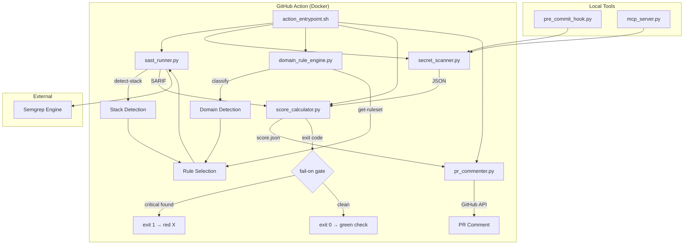

# VibeSafe Architecture

## Data Flow

1. **Stack Detection**: `sast_runner.py --detect-stack` → languages + frameworks from imports/configs
2. **Domain Classification**: `domain_rule_engine.py --classify` → ecommerce/fintech/platform/etc.
3. **Rule Selection**: domain + stack + languages + custom-rules → Semgrep config list
4. **SAST Scan**: Semgrep runs with selected configs → SARIF output
5. **Secret Scan**: regex + entropy analysis → JSON findings
6. **Scoring**: SARIF + secrets + domain weights + framework filtering → 0-100 score
7. **PR Comment**: findings grouped by file:line, framework false positives removed, fix suggestions added
8. **Fail Gate**: score.json → exit 1 if findings meet fail-on threshold

## Key Files

| File | Purpose |
|------|---------|
| `action.yml` | GitHub Action definition (inputs, outputs, Docker image) |
| `action_entrypoint.sh` | Orchestrator — runs all tools in sequence |
| `Dockerfile.action` | Docker image (Python 3.11 + Semgrep + git) |
| `tools/scanner/sast_runner.py` | Semgrep wrapper + stack detection |
| `tools/scanner/secret_scanner.py` | Regex + entropy secret detection |
| `tools/scanner/domain_rule_engine.py` | Domain classification + rule selection |
| `tools/report/score_calculator.py` | Scoring with domain weights |
| `tools/report/pr_commenter.py` | PR comment formatting + GitHub API |
| `tools/pre_commit_hook.py` | Local pre-commit secret detection |
| `tools/mcp_server.py` | MCP server for Claude Code/Cursor |
